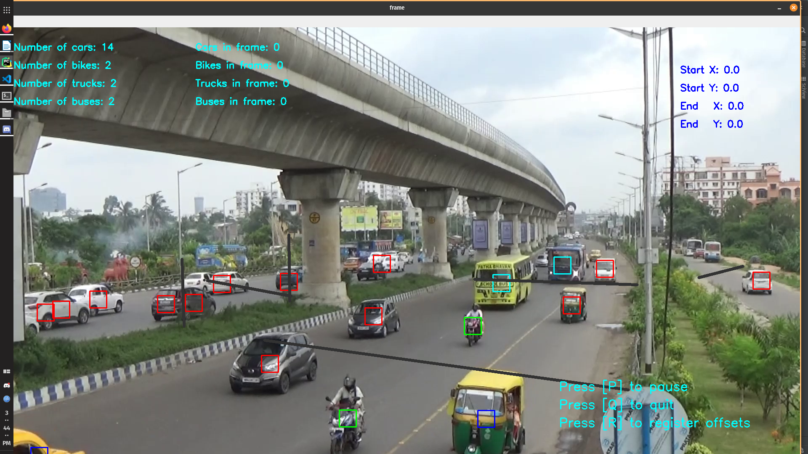

# Vehicle Counting Toolkit

An analyst's tool to assist in traffic volumetric measurement using your preferable choice of object detection model.

## Installation

You can download the latest stable release from [here]()

The bundle consists of a collection of batch scripts for working with [darknet](https://github.com/AlexeyAB/darknet) library, a command-line tool for generating tracking database and some python scripts for end-user analysts functions.

## Pre-Requisites

You have to download and install [CUDA](https://developer.nvidia.com/cuda-downloads), [cuDNN ](https://developer.nvidia.com/cuDNN), [FFmpeg](https://ffmpeg.org/), [cmake](https://cmake.org/install/), . Windows users may follow the respective webpages for installation instructions. For linux users, use the following commands

- FFmpeg: any
- CUDA Toolkit: v11.2 or higher
- cuDNN: v11.2 or higher _(same version as CUDA)_
- CMake: v3.16 or higher _(cmake --version)_

#### Ubuntu

```sh
sudo apt install ffmpeg
# After downloading CUDA runfile
sudo sh cuda_11.[YOURVERSION]_linux.run
# Update path in ~/.bashrc or ~/.zshrc manually (or use the following)
cat >> PATH=/usr/local/cuda-{11.2}/bin${PATH:+:${PATH}} >> ~/.bashrc
# or
cat >> PATH=/usr/local/cuda-{your-version}/bin${PATH:+:${PATH}} >> ~/.zshrc
```

#### RedHat/CentOS/Fedora

```sh
sudo dnf install https://mirrors.rpmfusion.org/free/fedora/rpmfusion-free-release-$(rpm -E %fedora).noarch.rpm https://mirrors.rpmfusion.org/nonfree/fedora/rpmfusion-nonfree-release-$(rpm -E %fedora).noarch.rpm
# Install from F32 channel. The dependencies for F33 channel are currently broken
sudo dnf config-manager --add-repo https://developer.download.nvidia.com/compute/cuda/repos/fedora32/x86_64/cuda-fedora32.repo
sudo dnf clean all
sudo dnf module disable nvidia-driver
sudo dnf -y install cuda
# Other tools
sudo dnf -y install cmake cmake-gui
```

For running the python scripts, the recommended method is miniconda

#### Ubuntu

#### RedHat/CentOS/Fedora

```sh
sudo dnf -y install conda
conda init zsh # or conda init bash
# restart shell
conda create -n {your-env-name-choice} python=3.7
conda activate {your-env-name-choice}
conda install -c conda-forge opencv
conda install numpy scikit-learn matplotlib
# Update path in ~/.bashrc or ~/.zshrc manually (or use the following)
cat >> PATH=/usr/local/cuda/bin${PATH:+:${PATH}} >> ~/.bashrc
# or
cat >> PATH=/usr/local/cuda/bin${PATH:+:${PATH}} >> ~/.zshrc
```

## Examples

The following example demonstrate how to use the tools specifically for tinyYOLO and the COCO dataset. it is assumed that you are using powershell for windows (most the commands would work same for batch).

#### Step 1: Extract frames from video

From an empty folder containing your v

```sh
mkdir outpath
ffmpeg -i "${path-to-your-video}" outpath/out-%03d.jpg
```

```powershell
mkdir outpath
ffmpeg -i "${path-to-your-video}" frames/out-%%03d.jpg
```

#### Step 2: Run them through a classifier

#### Step 3: Generate object tracking database

Edit `config.json` to specify input directory and output directory as you like

```json
{
  "input_files": {
    "traildetect_alt": "./input_traildetect",
    "traildetect": "",
    "stackplot": ""
  },
  "output_paths": {
    "traildetect_alt": "./output_traildetect",
    "traildetect": "./output_traildetect"
  }
}
```

Play around with the model settings and run the tool

```sh
# For windows --> tracking-db.exe, otherwise --> tracking-db
tracking-db videodetect
```

### Step 4: Run the analytics tool

Run the main.py from a python interpreter (if you preferred to use system libraries) or activate and use a miniconda environment as follows

```sh
conda activate {your-python-3.7-env}
python main.py
```

## Instructions

- [P] to pause ([P] again to unpause)
- [Q] to quit
- While video is paused, drawing a line on the canvas records the coordinates (which can be viewed once video is unpaused)

#### Marking lines

## Screenshots


